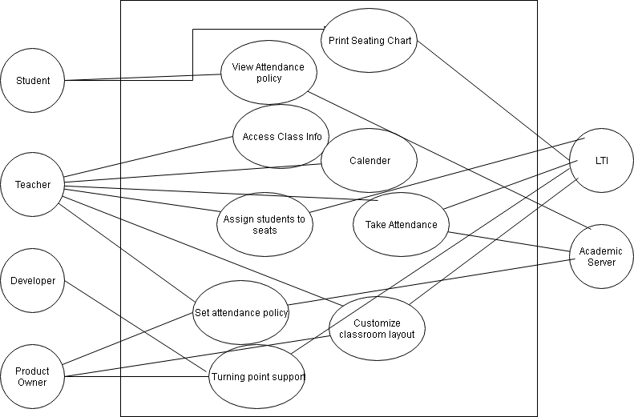

# Attendance

### Use Cases

#### Required

- Access class info (ie student list)
- Calendar
- Assign seats to students
- Default grid layout
- Take attendance
- View student attendance history
- View class attendance history
- Allow tardy
- Print seating chart
- Teacher can enable students to see seating chart
  - Students can see seating chart

#### Optional

- Customize classroom layout
- Flag students not meeting attendance policy
 - Requires setting attendance policy
- Turning Point support
- Preferred name

### Use Case Diagram
