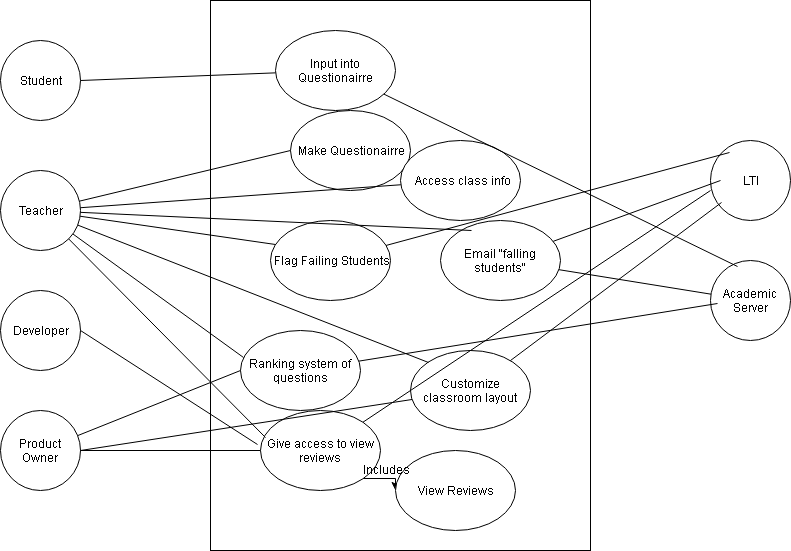

# Peer Review

### Use Cases

#### Required

- Default questionair
    - User inputs question
- Analytics over student responses
- Find a way to access class info
- Ranking system of questions
- Email notification for "failing students"
- LTI integration
- Teacher can make groups used for review system
- Reporting analytics to teacher
- Set dates for review
- Print out reviews
- Teacher can enable viewing your own reviews
  - Student can see their own reviews

#### Optional

- Student rating (good, bad)
- A way to search students to see rating

### Use Case Diagram

### Software Development Plan

